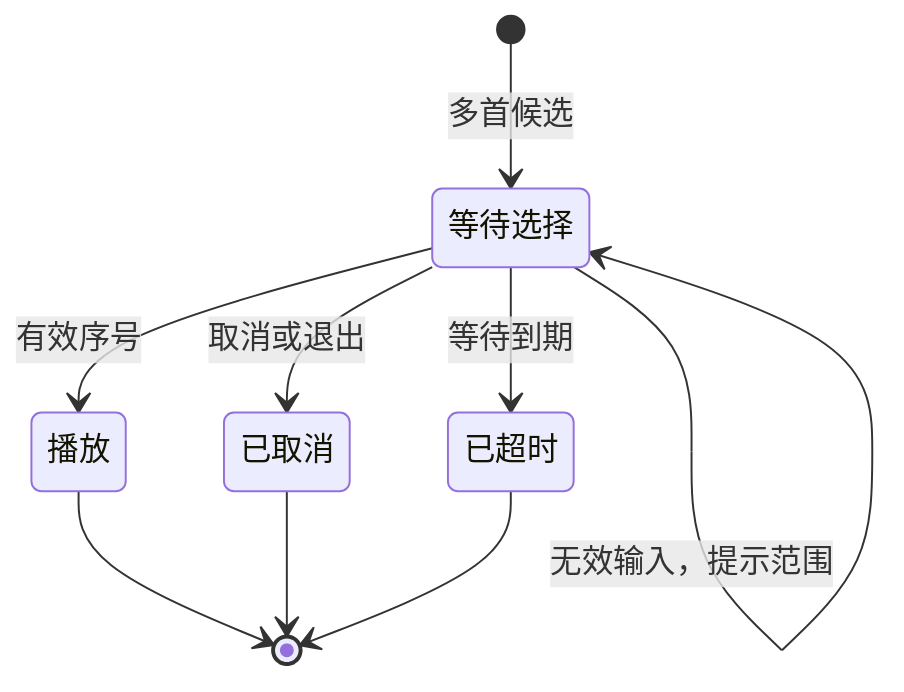

# 插件 Markdown 消息交互方案

## 消息边界

只有本插件主动发送的结果使用 Markdown。签到、老婆、资料、排行榜、歌曲列表、歌词、歌单、群管结果通过插件的 `markdown_result` / `markdown_chain_result` 创建新消息；仅这条结果设置 `use_markdown_=True` 和 `use_t2i_=False`。

普通聊天、主动聊天回复继续走 AstrBot 默认 Agent 管线，插件不替换聊天结果、不修改全局 Markdown 设置、不向聊天提示注入格式要求。工具直接发送结果后向模型返回发送状态，避免要求模型重新排版插件结果。

Markdown 展示依赖平台支持。支持原生 Markdown 的平台展示标题、加粗和列表；不支持的平台可能直接显示 Markdown 符号。QQ 官方群聊和 C2C（含 Webhook 适配器）支持原生 keyboard 按钮，其他平台与频道仍保留文字操作入口。本轮没有增加 Markdown 转图片服务。

## 统一视觉规则

- 每条结果最多一个三级标题：图标 + 操作结果，避免长昵称和角色名挤进标题。
- 关键数字单独加粗；明细使用短列表；说明和操作提示使用普通段落。
- 用空行划分标题、结果、明细、下一步；不使用聊天表格或大量分隔线。
- 昵称、角色名、歌名和歌手名按外部文本转义；歌词使用逐行引用，保留原来的行序。
- 媒体继续使用原生图片、音乐卡片或语音组件，不把本地图片路径塞进 Markdown 图片链接。
- 默认提示自然语言操作；只有启用传统指令时才补充对应指令。文字提示与原生按钮并存；文字提示本身不是按钮。

## 签到 → 资料 / 老婆

用户说“帮我签到”，工具直接发送：

```md
### 📅 签到成功 · 大吉

小明，今天好运在线！

**本次获得：+1860 积分**

- 基础奖励：1800
- 连签加成：60
- 连续签到：6 天
- 积分余额：**4260**

明天继续签到，延续好运 ✨
```

超大吉标题使用“🎊 签到成功 · 超大吉”，正文“大奖到手！”。基础奖励固定 10000，连签加成另计，到账数字显示实际总和。自定义奖励也按实际数值显示，不写死“万元大奖”。

再次签到显示“📅 今天已签到”、连签天数和余额，不重复发奖励。用户随后说“我的积分”“抽老婆”或“排行榜”，触发各自工具，不强制进入一个数字菜单。

## 老婆 → 换老婆

先发原生图片组件，再发送 Markdown 资料与原生 keyboard；避免图片消息模式吞掉按钮：

```md
### 💖 今日老婆

小明，今天与你相遇的是：

**安和昴**

- 今日换老婆：0 / 2 次

说“换老婆”即可。每次消耗 60 积分。
```

重看今日老婆复用已保存的图片，不重新抽取。图源没有角色名时，显示“今天的相遇在图片里”，不展示空的姓名占位。

换老婆成功显示“🔄 换老婆成功”、新角色、本次消耗和已用次数。次数用尽时，底部改为“明天可继续”；免费和不限次数配置分别显示真实费用与次数规则。

积分不足显示还差多少、所需费用和余额，并提示签到。图片获取失败发生在扣费之前，此时可以提示“本次未扣积分”。结果发送失败与图片获取失败不同：现有流程可能已经完成扣费与存储，此时不能承诺未扣费，用户可重看今日老婆获取已保存结果。

## 排行榜 → 本人位置

榜单展示 Top 10 条记录，前三个名次使用奖牌，其余明确显示“第 N 名”，避免客户端自动编号影响同分排名。相同积分共享名次，名次规则与数据库查询保持一致。

底部始终展示本人名次和积分，即使本人已经在榜单中；没有积分记录时提示签到。空榜单展示邀请文案，不展示空列表。

## 点歌的两种入口

| 场景 | 消息 | 用户下一步 | 范围 |
| --- | --- | --- | --- |
| 自然语言搜索 | 歌名、歌手、候选列表 | 说完整歌名与歌手，例如“播放周杰伦的稻香” | Agent 工具调用；QQ 官方可直接点击播放按钮 |
| 传统点歌的候选会话 | 编号列表、有效编号范围、等待时间 | 回复编号或“取消” | 本次会话 |
| 无结果 | 建议补全歌名或歌手 | 重新搜索 | 无等待会话 |
| 歌词 | 歌名加粗、正文逐行引用 | 继续聊天或点歌 | 无等待会话 |
| 歌单 | 编号列表 | “播放歌单第 1 首” / “删除歌单第 1 首” | Agent 工具调用 |

只有实际建立选歌等待会话时，才提示“回复序号”。自然语言搜索不伪装成已经建立的数字菜单。

等待会话只接收同一消息来源、同一用户的选择：



取消和超时分别发送简短反馈。其他用户或其他聊天来源的消息不会改变本次选择。只有一首候选或配置单曲直发时，直接播放，不展示多余菜单。

## 群管与异常文案

帮助使用自然语言示例，实际权限检查仍在群管方法中执行。旧群管结果统一放在“📋 操作结果”下，保留每个对象的处理结果，避免把第一位成员的结果误当成整条消息标题。

异常消息使用“发生了什么 + 可执行的下一步”，不暴露实现细节，不承诺没有验证过的退款或重试行为。批量群管存在部分成功时，逐项展示真实结果。

## 验收范围

1. 插件消息有 Markdown 标记；同一事件的普通结果保持原来的标记，插件格式化不修改聊天结果。
2. 已排版的消息再次经过发送助手不会叠加标题；歌词、特殊昵称与角色名不会破坏结构。
3. 签到显示实际到账总额；重复签到不入账；奖档、连签、费用使用当前配置。
4. 同分名次一致；本人在榜内、榜外、无记录和空榜单都有明确展示。
5. 免费换老婆、不限次数、次数耗尽、余额不足和取图失败都展示准确提示。
6. 选歌覆盖有效编号、无效输入、取消、超时、其他用户和其他来源；自然语言搜索不提示裸编号选择。
7. 原生 Markdown 与不支持 Markdown 的平台仍需真实 AstrBot 环境分别检查媒体顺序和显示效果。

## QQ 官方原生按钮（已实现）

| 消息 | 下方按钮 |
| --- | --- |
| 签到成功 / 今天已签到 | 查看排行榜、我的资料、抽老婆 |
| 今日老婆 / 换老婆成功 | 换老婆 · 当前费用、我的资料、查看排行榜 |
| 我的资料 | 签到、抽老婆、查看排行榜 |
| 排行榜 / 积分不足 | 签到、我的资料 |
| 歌曲搜索结果 | 播放第 1～4 首、我的歌单 |
| 我的歌单 | 刷新歌单、功能帮助 |
| 功能帮助 | 签到、抽老婆、查看排行榜、我的歌单 |

按钮每行最多两个。关闭的模块不展示对应默认按钮；老婆次数耗尽时隐藏换老婆按钮，免费时按钮显示“免费换老婆”。搜索结果的播放按钮保存当次歌曲信息，点击后播放对应歌曲，不重新搜索后误选其他版本。

默认开启 `qq_buttons_enable`。`qq_button_ttl` 默认为 600 秒，支持 30～3600 秒。按钮使用 QQ 官方 `keyboard.content.rows` 与指令按钮（action type 2），通过 `/aio_action <随机凭据>` 直接调度插件；无需 LLM，也不受 `command_enable` 开关影响。客户端支持自动发送时点击即可执行，其他客户端可能先填入输入框，需要用户发送该指令。

按钮的 payload 权限为通用点击，服务端对每个随机凭据校验发起人、完整聊天来源、自然日与有效期，不能通过点击别人的按钮操作其积分或老婆。每个按钮只能使用一次；先消耗凭据再执行业务，重复请求不会重复扣费。发起人可以用新结果中的新按钮继续操作，业务仍检查积分和每日次数。换老婆按钮还绑定展示时的费用；配置费用变化后，旧按钮提示刷新，不按新价格直接扣费。插件重载/重启后旧凭据失效。

按钮凭据只允许注册的插件动作，不接受用户提供的方法名或歌曲参数。触发按钮后中断该指令事件，普通聊天不会接管或复述按钮操作。积分相关按钮操作串行执行，防止同时点击不同按钮产生重复签到或错用次数。

QQ 官方账号需允许自定义 Markdown 与 keyboard。按钮消息发送失败时清理临时凭据并回退原来的 Markdown 文案与文字入口；已经发送的图片不重复发送，业务也不重复执行。频道、OneBot/NapCat 和其他适配器不调用官方 keyboard API。

实现位置：`core/buttons.py`；动作入口：`main.py` 的 `cmd_button_action`。验证命令：`python -m unittest discover -s tests -v`。测试使用模拟适配器，覆盖群聊/C2C payload、聊天格式隔离、平台降级、发送失败、归属与过期校验以及重复请求；实际按钮样式和平台权限仍需真实 QQ 官方账号实测。

接口参考：[QQ 官方 Keyboard 结构](https://tencentbot.apifox.cn/283774861d0)、[腾讯官方 botpy SDK](https://github.com/tencent-connect/botpy)、[AstrBot QQ 官方适配器](https://github.com/AstrBotDevs/AstrBot/blob/master/astrbot/core/platform/sources/qqofficial/qqofficial_message_event.py)。
